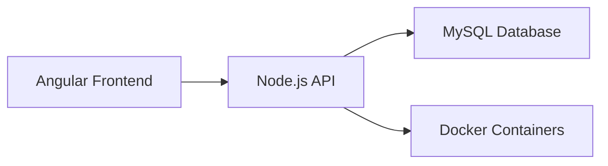

<h1 align="center">🧪 Electronics Lab Inventory System</h1>

<p align="center">
  <b>Full-Stack | Dockerized | DevOps Ready</b><br>
  Inventory management system for an electronics laboratory
</p>

<p align="center">
  
  
  
  
  
</p>

---

## 🚀 Overview

This project is a **full-stack web application** designed to manage an electronics laboratory inventory efficiently.
It integrates **frontend, backend, database, and containerization** into a complete system ready for real-world environments.

---

## ✨ Key Features

* 🔐 Authentication & role management (Admin / Auxiliar / Student)
* 📦 Inventory control and tracking
* 🔄 Loan and return system
* 🔍 Smart search and filtering
* 📊 Organization by categories and academic areas

---

## 🧠 Architecture



---

## 🛠️ Tech Stack

| Layer      | Technology              |
| ---------- | ----------------------- |
| Frontend   | Angular                 |
| Backend    | Node.js + Express       |
| Database   | MySQL                   |
| DevOps     | Docker & Docker Compose |
| Versioning | Git + GitHub            |

---

## 🐳 Run with Docker

### 1. Clone the repository

```bash
git clone https://github.com/Robert1401/lab-inventory-system-docker.git
cd lab-inventory-system-docker
```

---

### 2. Start containers

```bash
docker-compose up --build
```

---

### 3. Access the application

Open your browser and go to:

http://localhost:8081/public/Login/index.html

---

## 📂 Project Structure

```text
backend/        → REST API (Node.js)
frontend/       → Angular application
db/             → Database configuration
docker-compose.yml
```

---

## 👥 User Roles

| Role     | Permissions          |
| -------- | -------------------- |
| Admin    | Full system control  |
| Auxiliar | Inventory management |
| Student  | Request materials    |

---

## 📸 System Preview


---

## 🧪 DevOps & CI/CD

* Docker containerization
* Docker Compose orchestration
* GitLab CI/CD pipeline integration

---

## 📌 Notes

* Make sure Docker is running
* Verify port 8081 is available
* Use `docker ps` to verify containers

---

## 👨‍💻 Author

**Roberto Aram López Rodríguez**
Ingeniería en Sistemas Computacionales
Instituto Tecnológico de Saltillo

---

## ⭐ Support

If you like this project, consider giving it a ⭐ on GitHub!
